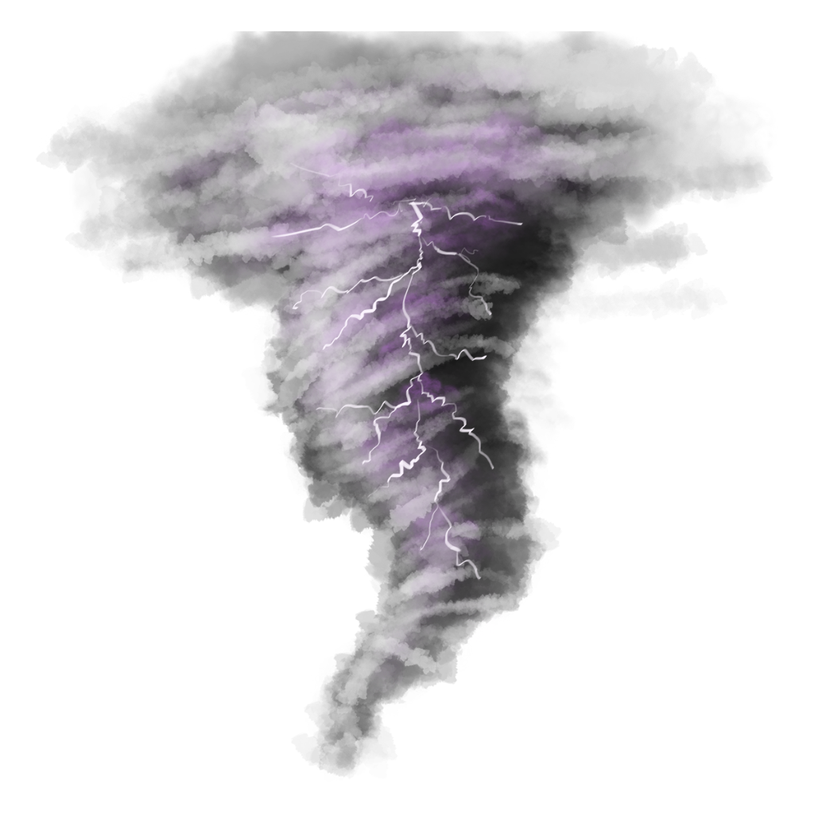

   

  <h1><b>TorNado</b></h1>
  
<i>Jellyfin TorBox Pro Usenet Integration Plugin</i>

TorNado brings the power of the TorBox Pro Usenet network directly into Jellyfin. This plugin replaces Jellyfin’s default search with TMDB-powered results and streams files on demand using TorBox Pro Usenet downloads.

### Features
- **Unified Search** – Jellyfin search pulls results directly from TMDB
- **TorBox Pro Usenet Integration** – Streams are resolved on-demand from TorBox Pro's Usenet (Newznab/Voyager) network
- **Database Integration** – TorNado items appear like native Jellyfin items
- **Proxy Support** – Streams are proxied through Jellyfin so everything is routed through a single IP
- **Per-User Configuration** – Users can configure overrides for paths and database restrictions

## Usage

1. **TMDB API Key** – Obtain a free API key from [The Movie Database (TMDB)](https://www.themoviedb.org/).
2. **TorBox Pro API Key** – Ensure you have an active TorBox Pro subscription and copy your API Key.
3. **Configure TorNado** – Install the plugin on Jellyfin 10.11.11, open the TorNado plugin page, and input your API keys.
4. **Library Configuration** – Point your Jellyfin library folders to the configured movie and series path stubs.
5. **Start Streaming** – Perform a search, select an item, and TorNado will resolve the NZB links through TorBox Pro to play instantly.

## Notes

- Requires a **TorBox Pro** account for Usenet network downloads and CDN links.
- Uses **TMDB** API for metadata search queries.
- Stream URL cache can be cleared by restarting the Jellyfin server.

